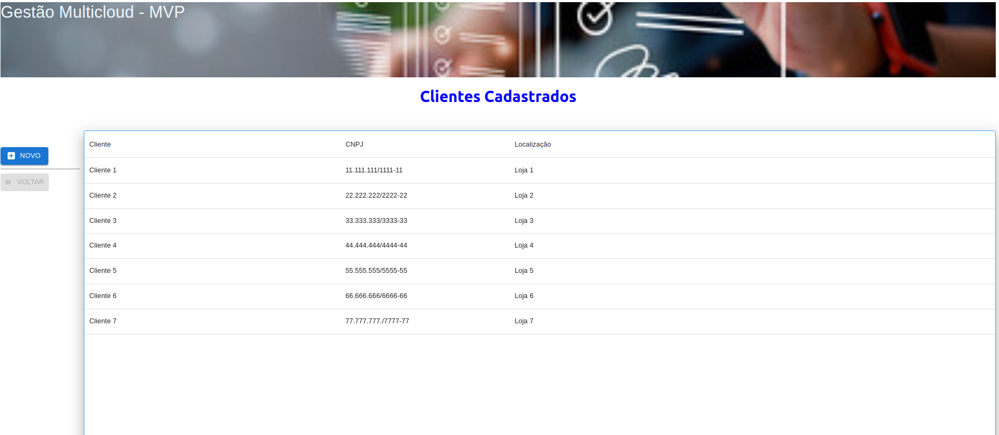

# Frontend Controle de Contratos - MVP

Este projeto integra o MVP da disciplina **Desenvolvimento Frontend Avançado**.

O desenvolvimento segue as especificações do protótipo figma disponibilizado neste [link](https://www.figma.com/design/SlqUMW8DEKEKWyWY5MigVb/Prototipa%C3%A7%C3%A3o-MVP-Desenv-Front-end--Avan%C3%A7ado?node-id=10-440).

Com o intuito de exercitar todos os conceitos vistos em aula foram utilizadas neste projeto as seguintes tecnologias:
    -- React (https://react.dev/)
    -- Vite (https://pt.vitejs.dev/)
    -- Mui (https://mui.com/)

O propósito principal deste trabalho é desenvolver um frontend que ofereça funcionalidades para o cadastro simplificado de clientes em um banco de dados SQLite.

# Atenção

Como o projeto ainda está em uma fase inicial, não possui um servidor web e rodará no servidor de desenvolvimento (nodejs). 

---
## Pré-requisitos

- Instalar os seguintes pacotes: **git** e **nodejs**.
- Clonar os repositórios [cloud-broker-api](https://github.com/albbassi/cloud-broker-api.git) e [cloud-broker-front-react-vite](https://github.com/albbassi/cloud-broker-front-react-vite.git).

---
## Como executar

- Inicialize a aplicação de backend que tem seu passo a passo descrito [aqui](https://github.com/albbassi/cloud-broker-api).
- Assim que o servidor de backend estiver ativo, navegue até a pasta onde a aplicação cloud-broker-front-react-vite-main foi clonada.
- Execute o comando **npm install** para baixar e instalar as bibliotecas necessárias à execução do frontend.
- Após o término da instalação execute o comando **npm run dev**.
- Para interagir com a aplicação, acesse a url **http://localhost:5173/**

**Divirta-se!**
